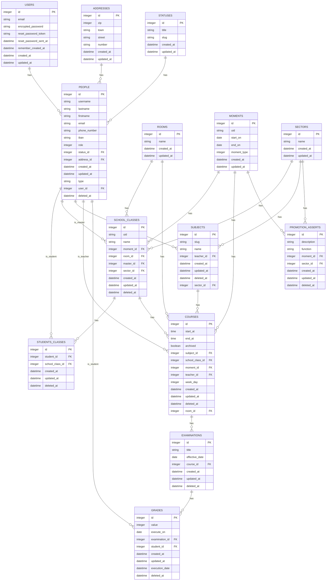

# School Management Database Model

```mermaid
erDiagram
    USERS ||--o{ PEOPLE : has
    ADDRESSES ||--o{ PEOPLE : has
    STATUSES ||--o{ PEOPLE : has
    PEOPLE ||--o{ STUDENTS_CLASSES : is_student
    SCHOOL_CLASSES ||--o{ STUDENTS_CLASSES : has
    PEOPLE ||--o{ SCHOOL_CLASSES : is_master
    ROOMS ||--o{ SCHOOL_CLASSES : has
    MOMENTS ||--o{ SCHOOL_CLASSES : has
    SECTORS ||--o{ SCHOOL_CLASSES : has
    SECTORS ||--o{ SUBJECTS : has
    PEOPLE ||--o{ SUBJECTS : is_teacher
    SCHOOL_CLASSES ||--o{ COURSES : has
    SUBJECTS ||--o{ COURSES : has
    MOMENTS ||--o{ COURSES : has
    PEOPLE ||--o{ COURSES : is_teacher
    ROOMS ||--o{ COURSES : has
    COURSES ||--o{ EXAMINATIONS : has
    EXAMINATIONS ||--o{ GRADES : has
    PEOPLE ||--o{ GRADES : is_student
    MOMENTS ||--o{ PROMOTION_ASSERTS : has
    SECTORS ||--o{ PROMOTION_ASSERTS : has

    USERS {
        integer id PK
        string email
        string encrypted_password
        string reset_password_token
        datetime reset_password_sent_at
        datetime remember_created_at
        datetime created_at
        datetime updated_at
    }

    ADDRESSES {
        integer id PK
        integer zip
        string town
        string street
        string number
        datetime created_at
        datetime updated_at
    }

    STATUSES {
        integer id PK
        string title
        string slug
        datetime created_at
        datetime updated_at
    }

    PEOPLE {
        integer id PK
        string username
        string lastname
        string firstname
        string email
        string phone_number
        string iban
        integer role
        integer status_id FK
        integer address_id FK
        datetime created_at
        datetime updated_at
        string type
        integer user_id FK
        datetime deleted_at
    }

    SECTORS {
        integer id PK
        string name
        datetime created_at
        datetime updated_at
    }

    MOMENTS {
        integer id PK
        string uid
        date start_on
        date end_on
        integer moment_type
        datetime created_at
        datetime updated_at
    }

    ROOMS {
        integer id PK
        string name
        datetime created_at
        datetime updated_at
    }

    SCHOOL_CLASSES {
        integer id PK
        string uid
        string name
        integer moment_id FK
        integer room_id FK
        integer master_id FK
        integer sector_id FK
        datetime created_at
        datetime updated_at
        datetime deleted_at
    }

    STUDENTS_CLASSES {
        integer id PK
        integer student_id FK
        integer school_class_id FK
        datetime created_at
        datetime updated_at
        datetime deleted_at
    }

    SUBJECTS {
        integer id PK
        string slug
        string name
        integer teacher_id FK
        datetime created_at
        datetime updated_at
        datetime deleted_at
        integer sector_id FK
    }

    COURSES {
        integer id PK
        time start_at
        time end_at
        boolean archived
        integer subject_id FK
        integer school_class_id FK
        integer moment_id FK
        integer teacher_id FK
        integer week_day
        datetime created_at
        datetime updated_at
        datetime deleted_at
        integer room_id FK
    }

    EXAMINATIONS {
        integer id PK
        string title
        date effective_date
        integer course_id FK
        datetime created_at
        datetime updated_at
        datetime deleted_at
    }

    GRADES {
        integer id PK
        integer value
        date execute_on
        integer examination_id FK
        integer student_id FK
        datetime created_at
        datetime updated_at
        datetime execution_date
        datetime deleted_at
    }

    PROMOTION_ASSERTS {
        integer id PK
        string description
        string function
        integer moment_id FK
        integer sector_id FK
        datetime created_at
        datetime updated_at
        datetime deleted_at
    }
``` 